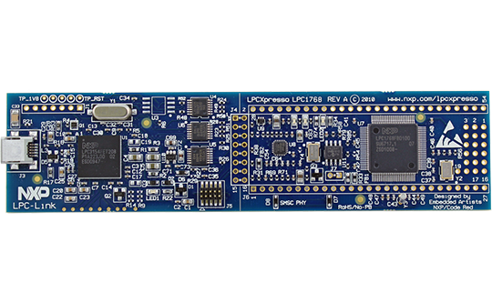
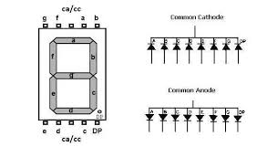
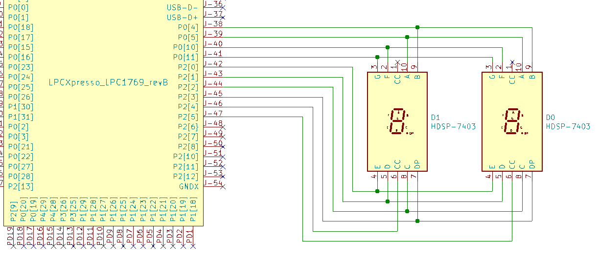
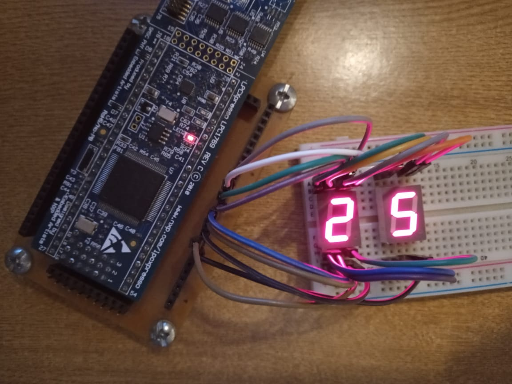

#   Display 7 segmentos - LPC1769 example
Proyecto ejemplo para controlar un display 7 segmentos de 2 dígitos con el micro controlador LPCXpresso lpc1769.

---
- IDE: [MCUXpresso IDE](https://www.nxp.com/design/software/development-software/mcuxpresso-software-and-tools-/mcuxpresso-integrated-development-environment-ide:MCUXpresso-IDE).
- Lenguaje: C.
- Microcontrolador: [LPCXpresso lpc1769 rev C](https://www.embeddedartists.com/products/lpc1769-lpcxpresso/).
- Display 7 segmentos cátodo común.

---
## LPCXpresso LPC1769
 

## Display 7 segmentos

## Circuito ensayado - 2 dígitos

## Captura del ensayo - 2 dígitos

---
Autor: @ealegremendoza

E-mail: ealegremendoza@gmail.com
